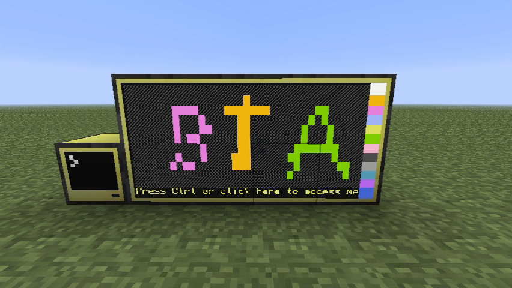

# BTA CC Tweaked
*A port of the modern CC: Tweaked mod to the Better Than Adventure beta version of Minecraft.*

CC: Tweaked is a Minecraft mod that introduces programmable computers, turtles, and more.
As a fork of the classic **ComputerCraft**, it builds on its legacy with enhanced performance, greater stability, and a wide array of new features.

Better Than Adventure! (BTA) is an unofficial continuation of Minecraft Beta 1.7.3, originally released in 2011.
It aims to breathe new life into classic Minecraft by adding new gameplay mechanics, quality-of-life improvements, and various optimizations.

**BTA CC Tweaked** is a mod that enables CC: Tweaked to run on BTA, with only minimal adjustments required.

**Currently compatible with CC: Tweaked version 96.0.**

CC Tweaked Wiki https://tweaked.cc/

Requirements:

- BTA (https://www.betterthanadventure.net)
- Babric for BTA https://github.com/Turnip-Labs/babric-instance-repo/releases/tag/v7.3_01
- HalpLibe (https://github.com/Turnip-Labs/bta-halplibe)

[Original CC Tweaked Repo](https://github.com/cc-tweaked/CC-Tweaked) |
[Original CC Restitched Repo](https://github.com/cc-tweaked/cc-restitched)
